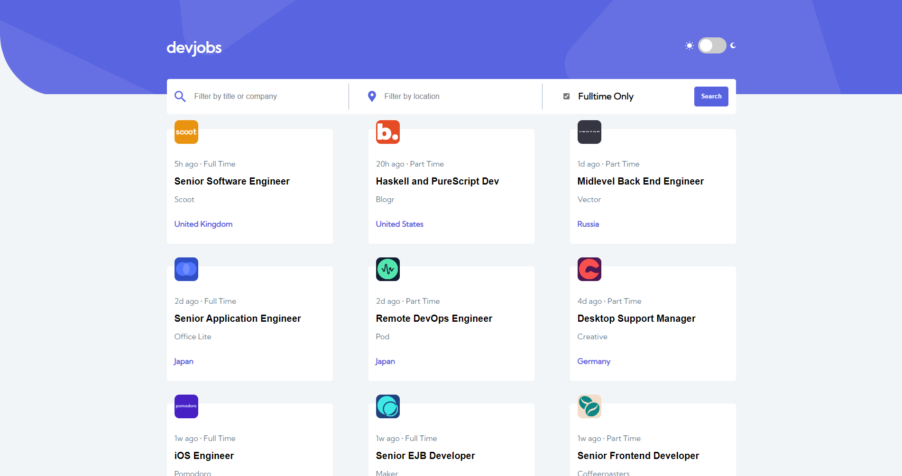

# devjobs - React Job Board with Filtering and Dynamic Routes

## Overview

This React application displays a list of jobs which users can filter through by title, company name, location, and contract status.

Users should be able to:

- View the optimal layout for each page depending on their device's screen size
- See hover states for all interactive elements throughout the site
- Be able to filter jobs on the index page by title, location, and whether a job is for a full-time position
- Be able to click a job from the index page so that they can read more information and apply for the job

### Screenshot

### Links

- Live Site URL: [https://devpositions.netlify.app/](https://devpositions.netlify.app/)

### Built with

- [React](https://reactjs.org/) - JS library
- React Context API
- React Router
- SCSS
- Flexbox
- Mobile-first workflow

## Author

- Website - [Aaron Buachie](https://abuachie.com)
